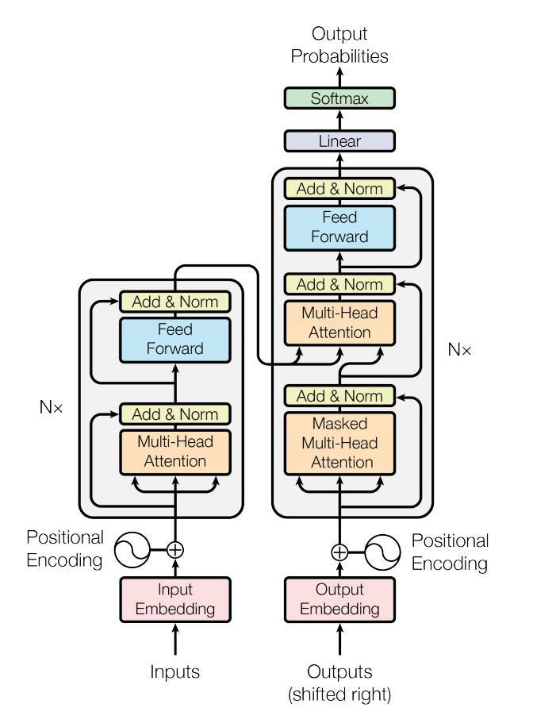

## 1.trans-text(Language Modeling with nn.Transformer and TorchText)

This is a tutorial on training a sequence-to-sequence model that uses the nn.Transformer module.

The PyTorch 1.2 release includes a standard transformer module based on the paper Attention is All You Need. Compared to Recurrent Neural Networks (RNNs), the transformer model has proven to be superior in quality for many sequence-to-sequence tasks while being more parallelizable. The nn.Transformer module relies entirely on an attention mechanism (implemented as nn.MultiheadAttention) to draw global dependencies between input and output. The nn.Transformer module is highly modularized such that a single component (e.g., nn.TransformerEncoder) can be easily adapted/composed.

### 